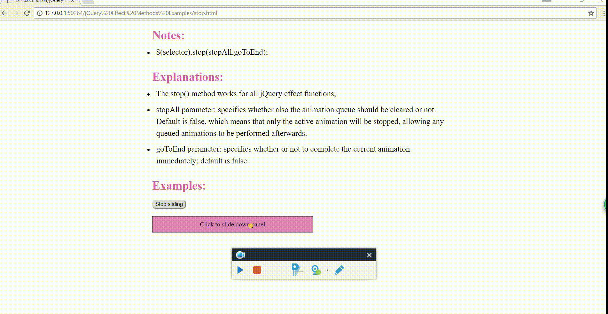

# Interesting problem: jQuery stop() effect method

When I try to use jQuery stop() effect method to stop a slicing-down panel, I find that the text in the div element will show up, even though the div element itself stops.

See the following gif picture: (repository link: https://github.com/Yiqiuuuuuu/About-jQuery/blob/master/jQuery%20Effect%20Methods%20Examples/stop.html)

