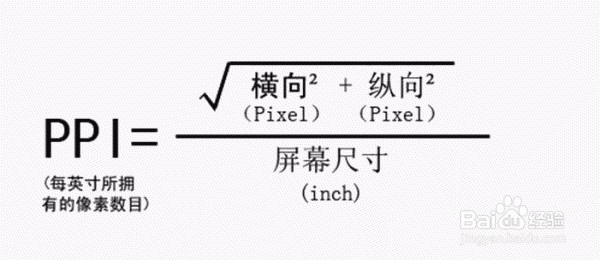
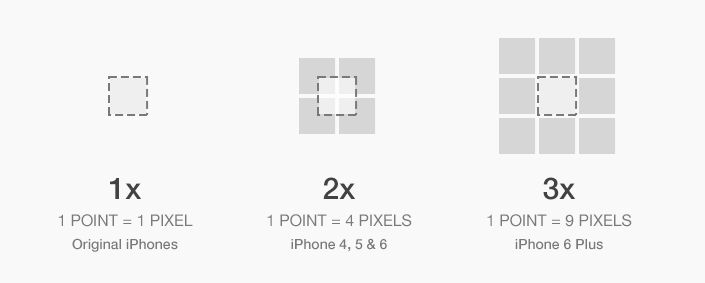
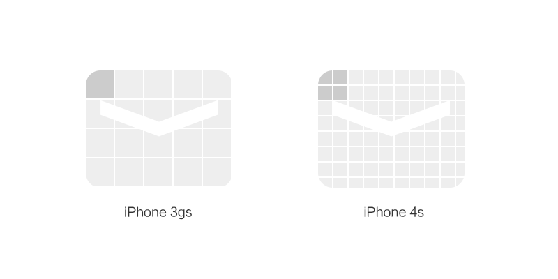
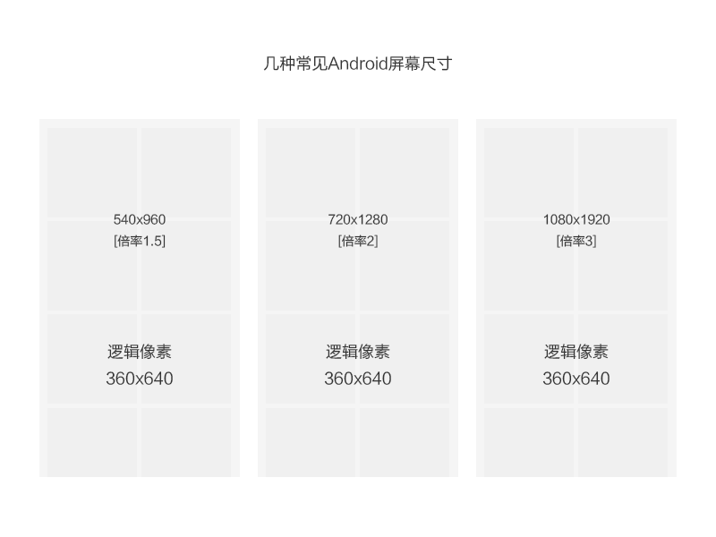

# Pixels, points and resolutions

http://colachan.com/post/3435
http://blog.fluidui.com/designing-for-mobile-101-pixels-points-and-resolutions/

### - Pixel（“像素”） (a picture element: a single dot of colour on a screen)
一个pixel就是能发光的一组点， 我猜想可能是多个MOSFET之类的吧。
> A pixel is a single group of coloured dots (normally red, green and blue) on a screen. By turning them on and off at different intensities, any number of colours and brightness can be created.

> The colour black is created when all the dots are off, and white is created when red, green and blue are all on at the same time.

> In short, they are the **physical lights** on a screen that allow you to see what's being displayed where each one is so small you can't individually identify them without looking very closely.

### - Screen sizes (in inches;  1 inch=2.54 cm)
机屏幕的物理尺寸，是对角线尺寸，单位是英尺。
Screen size is the length of the screen **diagonally(“对角的”)** or from one corner to the other.

### - Resolutions （“解析度”） (a width and height, e.g.320w*480h)
**Resolution = number of pixels going across the screen \* the number of pixels going down the screen**

举个例子吧，就比如说以前的老的iPhone，横着有320像素，竖着有480像素，解析度就是320\*480，比较让人confused就是这个解析度跟设备的实际物理尺寸是没有关系的，现在有些手机仍然是5 inch的屏幕，但是却有着1920\*1080跟电视一样的解析度。

### - DPI (dots per inch or pixels per inch 可能是“像素密度”的意思)
> DPI (dots per inch)， or PPI(pixels per inch) is a number that measures how many pixels are contained either across or down in a single inch of screen space.

DPI = (number of pixels across the screen) / (width in inch)
或者DPI = (number of pixels down the screen) / (height in inch)
或者：

假如width固定不变，如果DPI很高，说明这个手机屏幕的resolution很高，就是说在有限的物理尺寸里，填塞很多的pixels，那么就得要求每个pixels非常小，曾经认识位物理系的同学做MOSFET，当时年轻的我还在学集成电路...认为MOSFET主要就用在微电子领域，聊过之后了解的她就在做屏幕用MOSFET方面的课题，之后去买佳能相机的时候，好多镜头展品前面也都挂着牌子写着“MOSFET”。随着MOSFET尺寸的变小，pixels也将越来越小，我们可以看到的图片将会越来越清晰，越来越注重细节。

> What is considered high or low DPI?
> A good DPI depends very much on how far away from the screen you typically are. That’s why the latest phones have the same or a higher number of pixels as a high definition TV, even though the size of the screens differs hugely. Mobile devices that have a higher DPI are typically better because they are held closer to your eyes (4-6 inches/10-15cm) and therefore you can make out a lower density far easier than you could if you were looking at something further away, like a tv (typically 4-6 metres/yards).

> Is there a highest possible DPI?
> There isn’t really a highest possible DPI (there might be some limitations when we are down at the level of atoms, but we are not really there yet), but there is a limit in terms of what the human eye can perceive. That limit comes in at about 2190DPI for a screen held at 4 inches for the average adult. After that, humans can’t perceive the difference, so there would be little benefit in improving the resolution past this point.

### - Point (an abstract measurement for iOS, 简写成pt)
> Once upon a time, the original iPhone had a screen resolution of 320x480. Then the iPhone 4 came along, and with it, the Retina screen. The Retina screen doubled the DPI while keeping the same screen size - meaning the number of pixels that fit into the same space had quadrupled (twice the number of pixels across and twice the number of pixels down). The resolution of the first Retina iPhone was therefore 640x960 pixels.

> But all the old graphics had to be drawn at the same size on the higher density phone. If the phone had drawn all the graphics at a 1:1 scale like it did originally, everything would have been drawn at a quarter the size in the new screen - making every old app obsolete and broken. To prevent all those apps not working any more, Apple started using points as a way of separating the drawing of the graphics from the density of the screen they were on.

> 

也就是说point是苹果公司自己给出的逻辑像素单位。1 pixel就是1 pixel，它是一个不变的单位，而point是一个相对单位，取决于DPI。
举例来说，对于以前那些老的iPhone，它们的像素密度是163DPI，那么point = 1 pixel。
像iPhone4,5，6， 它们的像素密度达到了326DPI，此时 1point = 4 pixels。
箱iPhone6+, 1 point = 9 pixels。

> iPhone 3gs的屏幕像素是320x480，iPhone 4s的屏幕像素是640x960。刚好两倍，然而两款手机都是3.5英寸的。
> 

### - Density Independent Pixels (A similarly abstract measurement for Android)
简写成DIP或者DP，与point差不多，是安卓自己定义的逻辑像素，都是抽象的，都是virtual pixel units。
> 
