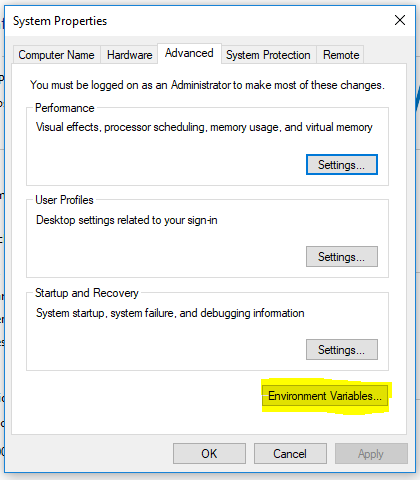

# Test - How to set PATH variable on Windows10?

* Step1: left click on "Start" icon at bottom left corner  

* Step2: click "settings" icon 

* Step3: click on "system" section

* Step4: select "About" in the left menu bar, and then click "System info" on the right side

* Step5: click "Advanced system settings" on the left side

* Step6: click on "Enviroment Variables" 

