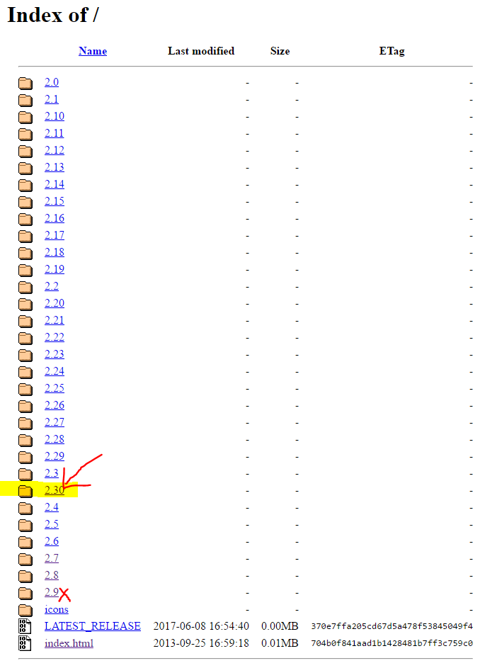

# Test - Set Selenium in Node

First of all, I wrote this tech-blog to help myself to learn and to remember how to set selenium. I followed the steps on this tutorial:<br> https://developer.mozilla.org/en-US/docs/Learn/Tools_and_testing/Cross_browser_testing/Your_own_automation_environment

1. To start with, set up a npm project (folder name: selenium-test).
2. Install framework **Selenium-WebDriver**.
   <br>**WebDeiver** is a powerful API that builds on top of Selenium and makes calls to a browser to automate it, carrying out actions such as "open this web page","move over this element on the page","click this link","see whether the link opens this URL",etc.
   <br>Notice: run this command **inside the npm project folder!!** :no_mouth:
```
npm install selenium-webdriver
```
3. Download browser drivers from [selenium-webdriver](https://www.npmjs.com/package/selenium-webdriver) pages (see the table in the first section) for different browsers.<br>
 <br>
 Just to mention, when try to download chromedriver, download the latest version2.30. I though 2.9 is the latest one.:cold_sweat:<br>
  
 There is another access to download chromedriver where it is more clear :https://sites.google.com/a/chromium.org/chromedriver/downloads
  I put all downloaded drivers in D:\workspace\BrowserDrivers.The folder structure looks like this:<br>
```
D \ workspace \ selenium-test  \ package.json
                               \ node_modules\...
                               \ google_test.js
                               \ google_test_multiple.js
              \ BrowserDrivers \ chromedriver.exe
                               \ geckodriver.exe
                               \ MicrosoftWebDriver.exe
```

4. Set the path of the drivers. See my another tech-blog: [Test - How to set PATH variable on Windows10?](https://github.com/Yiqiuuuuuu/tech-blog/blob/master/Test%20-%20Set%20PATH%20variable.md)<br>

5. Try to test to make sure everything is working.
  * Create a new file inside your project directory called google_test.js:
  * Give it the following contents, then save it:
  ```javascript
  var webdriver = require('selenium-webdriver'),
      By = webdriver.By,
      until = webdriver.until;
  var driver = new webdriver.Builder()
      .forBrowser('chrome')
      .build();
  driver.get('http://www.google.com');
  driver.findElement(By.name('q')).sendKeys('webdriver');
  driver.findElement(By.name('btnG')).click();
  driver.sleep(2000).then(function() {
    driver.getTitle().then(function(title) {
      if(title === 'webdriver - Google Search') {
        console.log('Test passed');
      } else {
        console.log('Test failed');
      }
    });
  });
  driver.quit();
  ```
  * In terminal, make sure **I am inside my project folder**, then enter the following command:
```
node google_test
```
An instance of chrome should automatically open up. Google should automatically be loaded in a tab.
"webdriver" should be entered in the search box of google.  The search button should be then clicked.
WebDriver will then wait for 2 seconds; the document title is then accessed, and if it is "webdriver - Google Search", we will return a message to claim the test is passed. WebDriver will then close down the chrome instance and stop.
It's like the computer is haunted....:scream_cat:
Notice: Selenium Version: 3.4.0 (the newest release when i write this blog) does not go well with geckodriver when I run google_test.js.
The issue is fixed but seems to be not released yet. So I'm **not** gonna test any firefox examples right now. See the link of this issue:<br>https://github.com/SeleniumHQ/selenium/issues/4041
6. create another file in the same project folder (name: google_test_multiple.js).
