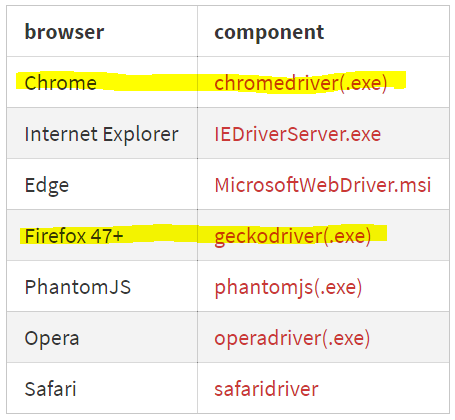
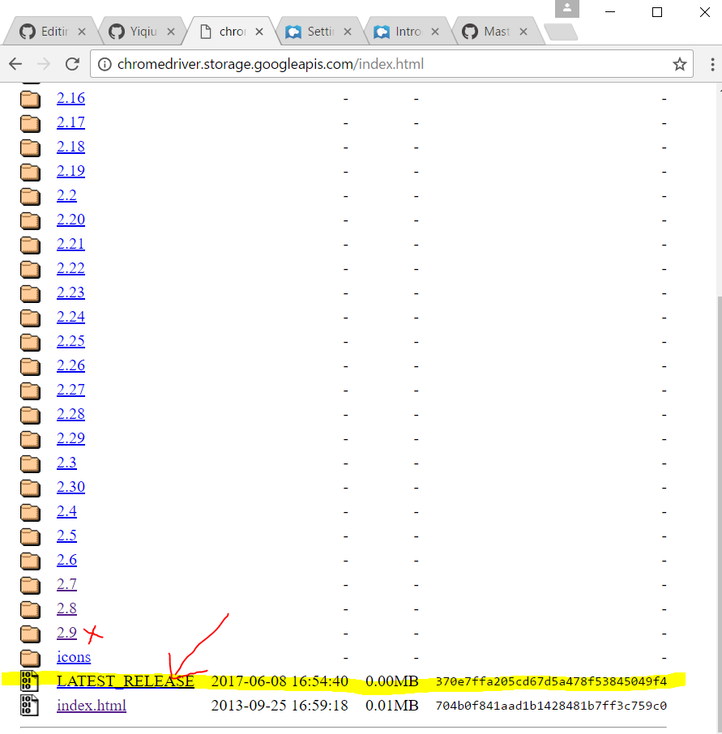

# Test - Set Selenium in Node

1. To start with, set up a npm project (folder name: selenium-test).
2. Install framework **selenium-webdriver**. <br>Notice: run this command inside the npm project folder!! :no_mouth:
```
npm install selenium-webdriver
```
3. Download browser drivers from [selenium-webdriver](https://www.npmjs.com/package/selenium-webdriver) pages (see the table in the first section) for different browsers.<br> 
 <br>
 Just to mention, when try to download chromedriver, download the latest version. I though 2.9 is the latest one. How stupid...:cold_sweat:<br>
  
  I put all downloaded drivers in D:\workspace\BrowserDrivers.The folder structure looks like this:<br>
```
D \ workspace \ selenium-test  \ package.json
                               \ node_modules\...
                               \ google_test.js
              \ BrowserDrivers \ chromedriver.exe
                               \ geckodriver.exe
```

4. Set the path of the drivers. See my another tech-blog: [Test - How to set PATH variable on Windows10?](https://github.com/Yiqiuuuuuu/tech-blog/blob/master/Test%20-%20Set%20PATH%20variable.md)<br>

5. Try to test to make sure everything is working.
* Create a new file inside your project directory called google_test.js:
* Give it the following contents, then save it:<br>
  
```
var webdriver = require('selenium-webdriver'),
    By = webdriver.By,
    until = webdriver.until;

var driver_chr = new webdriver.Builder()
    .forBrowser('chrome')
    .build();

searchTest(driver_chr);

function searchTest(driver) {
  driver.get('http://www.google.com');
  driver.findElement(By.name('q')).sendKeys('webdriver');
  driver.findElement(By.name('btnG')).click();

  driver.sleep(2000).then(function() {
    driver.getTitle().then(function(title) {
      if(title === 'webdriver - Google Search') {
        console.log('Test passed');
      } else {
        console.log('Test failed');
      }
    });
  });

  driver.quit();
}
```

* In terminal, make sure you are inside your project folder, then enter the following command:<br>

```
node google_test
```
An instance of chrome should automatically open up. Google should automatically be loaded in a tab. 
"webdriver" should be entered in the search box of google.  The search button should be then clicked.
WebDriver will then wait for 2 seconds; the document title is then accessed, and if it is "webdriver - Google Search", we will return a message to claim the test is passed. WebDriver will then close down the chrome instance and stop.

It's like the computer is haunted....:scream_cat:


Notice: Selenium Version: 3.4.0 (the newest release when i write this blog) does not go well with geckodriver when I run google_test.js.
The issue is fixed but seems to be not released yet. So I'm not gonna test any firefox examples right now. See the link of this issue:<br>https://github.com/SeleniumHQ/selenium/issues/4041


  
